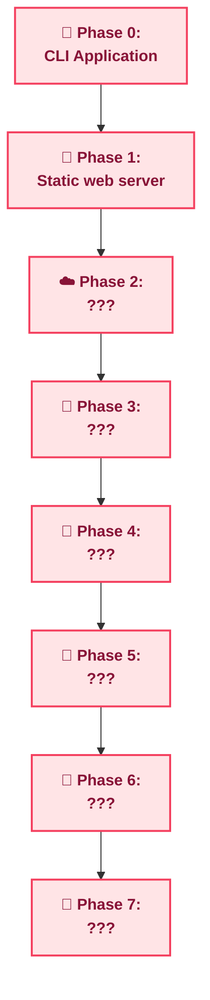

> [!IMPORTANT]  
> This app is currently still in development.

<table border="0">
  <tr>
    <td></td>
    <td></td>
    <td></td>
  </tr>
</table>

  
🧴 <b>Main branch </b>

  
## Prerequisites

To run this application locally, you will need to set up your environment and database connection. This includes:
* IntelliJ Idea (I'm using version 2025.3.3)
* sqldeveloper (for creating your Oracle database)

### 1. Database Setup
To set up the schema, use the following files:
* `db.sql`: The database skeleton (tables and schema).
* `inserts.sql`: An example file for initial data inserts.
  
*Note: A template will be added soon.*

### 2. Configuration
You will need a `resources` folder in the root directory. Inside, create a `config` file containing your Oracle Database authentication details.

*Note: A template will be added soon.*

## Features
* View Collection: Browse all perfumes currently in your database.
* Note Search: Find perfumes based on a specific scent note.
* Layering Recommendations: A complex algorithm that suggests perfume combinations for an harmonious scent profile.
* Add Perfumes: Easily add perfumes without complex SQL inserts.
* Disable Perfumes: Ability to soft delete perfumes from your database.
---

  
🌸 <b>Phase 1 branch</b>

  
  ## Self-explanatory.
  
  

---

## Roadmap

> Developed 03/2026->present

