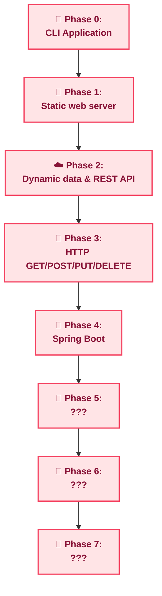

> [!IMPORTANT]  
> This app is currently still in development.

<table border="0">
  <tr>
    <td></td>
    <td></td>
    <td></td>
  </tr>
</table>

  
🧴 <b>Main branch </b>

  

## Prerequisites

To run this application locally, you will need to set up your environment and database connection. This includes:
* IntelliJ Idea (I'm using version 2025.3.3)
* sqldeveloper (for creating your Oracle database)

### 1. Database Setup
To set up the schema, use the following [files](https://gist.github.com/mirunq-png/69a88cca8faa8c2c09a6fe81deb80079):
* `db.sql`: The database skeleton (tables and schema).
* `inserts.sql`: An example file for initial data inserts.
  
### 2. Configuration
You will need a `resources` folder in the root directory. Inside, create a `config` [file](https://gist.github.com/mirunq-png/b139489536fc510969c92f5ee49cbd0b) containing your Oracle Database authentication details.

## Features
* View Collection: Browse all perfumes currently in your database.
* Note Search: Find perfumes based on a specific scent note.
* Layering Recommendations: A complex algorithm that suggests perfume combinations for an harmonious scent profile.
* Other CRUD operations
---

  
🌸 <b>Phase 1 branch</b>

  
  

  ## What's new
  * Java Servlets
  * HTML, CSS

  ---
  

  
☁️ <b>Phase 2 branch</b>

  ## What's new
  * Viewing your collection and scent recommandations from UI
  * REST API
  * JavaScript+HTML for UI
  
  ---
  

  
☁️ <b>Phase 3 branch</b>

  ## Prerequisites

  To run this application locally, you will need to set up your environment and database connection. This includes:
  * IntelliJ Idea (I'm using version 2025.3.3) and JDK21
  * PostgreSQL (I'm using version 18.4.2)
  * Git

  ### 1. Database Setup
  To set up the schema, use the following [files](https://gist.github.com/mirunq-png/38ed932165fc39701b1ed5d1441d0eff):
  * `db.sql`: The database skeleton (tables and schema).
  * `inserts.sql`: An example file for initial data inserts.

  ### 2. Cloning the repo
  Copy the repo URL: `https://github.com/mirunq-png/perfume-app` and clone it in IntelliJ. Make sure you switch to the `phase3` branch.
  
  ### 3. Configuration
  You will need a `resources` folder in `src/main`. Inside, create a `config.properties` [file](https://gist.github.com/mirunq-png/ee19936e8fac68b560fea0333b6b2c9f) containing your PostgreSQL Database authentication details.
  
  You will need to set up the Smart Tomcat plugin. After having downloaded [Apache Tomcat 9.0](https://tomcat.apache.org/download-90.cgi):
  - CTRL+Alt+S -> Plugins -> "smarttomcat" -> Install
  - CTRL+Shift+A -> "Edit configuration" -> Add new run configuration -> Smart Tomcat -> fill in the config fields
  
  
  Make sure the deployment directory is the `webapp` folder and that you add a context path.

  ## What's new
  * Adding/modifying/deleting perfumes from UI
  * Migration to PostgreSQL
  ---
  

  
🎂 <b>Phase 4 branch</b>

  ## What's new
  N/A
  ---
  

---

## Roadmap

```mermaid
graph TD
    %% Phase 0
    P0["🧴 Phase 0:<br/>CLI Application"]
    %% Phase 1
    P1["🌸 Phase 1:<br/>Static web server"]
    
    %% Phase 2
    P2["☁️ Phase 2:<br/>Dynamic data & REST API"]
    
    %% Phase 3
    P3["🍓 Phase 3:<br/>HTTP GET/POST/PUT/DELETE"]
    
    %% Phase 4
    P4["🎂 Phase 4:<br/>Spring Boot"]
    
    %% Phase 5
    P5["🍰 Phase 5:<br/>???"]
    
    %% Phase 6
    P6["🎀 Phase 6:<br/>???"]
    
    %% Phase 7
    P7["💖 Phase 7:<br/>???"]

    %% Flow connections
    P0 --> P1
    P1 --> P2
    P2 --> P3
    P3 --> P4
    P4 --> P5
    P5 --> P6
    P6 --> P7

    %% Sweet Pink Styling
    classDef pinkVibe fill:#ffe4e6,stroke:#f43f5e,stroke-width:2px,color:#881337,font-weight:bold,border-radius:10px;
    
    %% Apply styling to all phases
    class P0,P1,P2,P3,P4,P5,P6,P7 pinkVibe;
```
> Developed 03/2026->present

